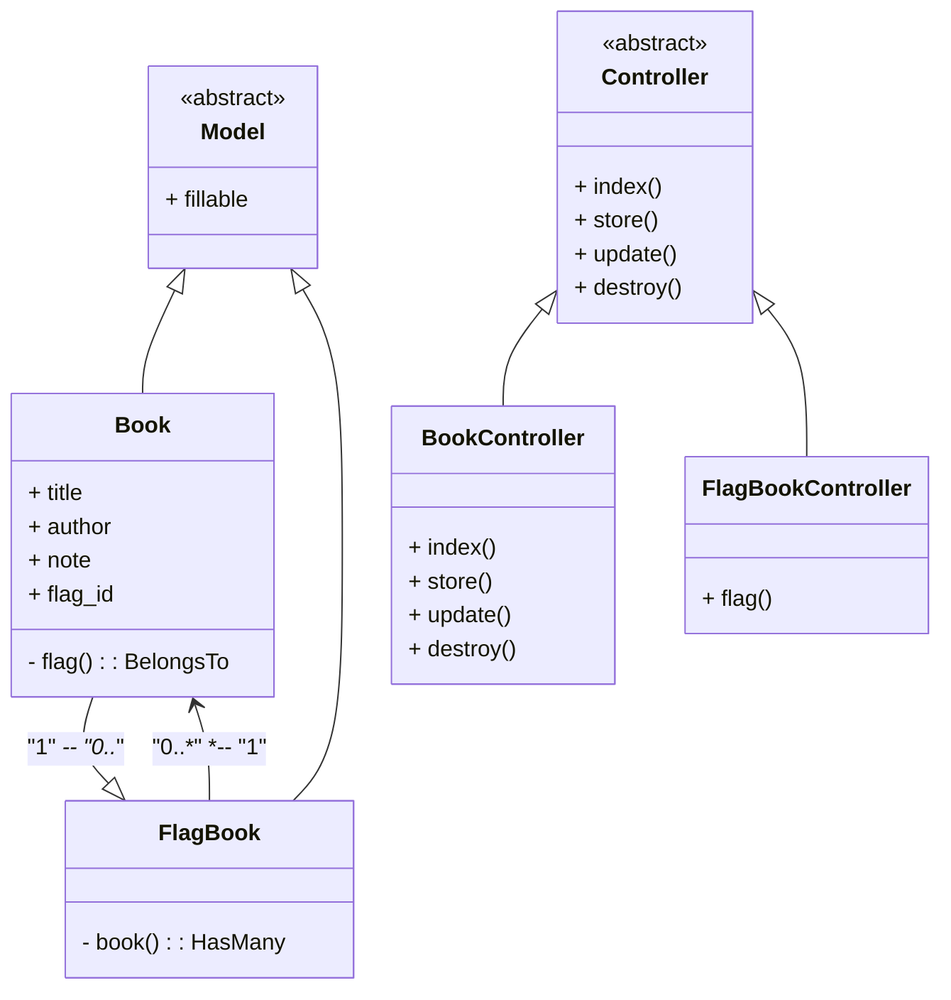
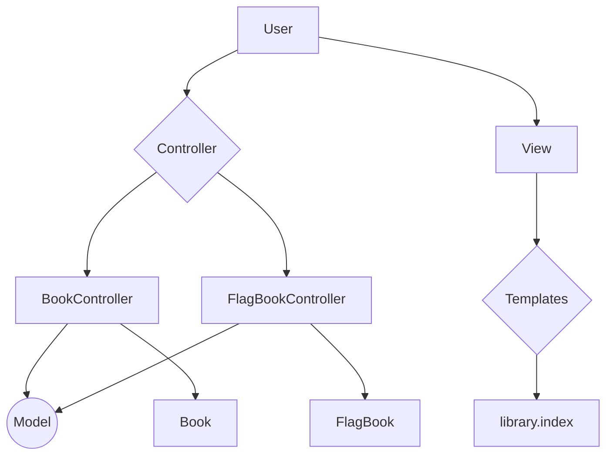

# Biblioteca #
## Plusoft - teste 05/2024 ##

Requisitos do teste:
- [x] Aplicação web com a linguagem de preferência
- [x] Aplicação deve permitir criação, leitura, edição e exclusão da informação (CRUD)
- [x] Deve utilizar um banco de dados
- [x] Deve utilizar algum padrão de projeto e possuir a estrutura clara

Notas:
- É permitido utilizar **qualquer** framework no desenvolvimento.
- O arquivo READ ME deve conter instruções para a execução da aplicação e a justificativa das decisões tomadas no desenvolvimento  (arquitetura, padrão de projeto, uso de frameworks, etc)

## Projeto ##
Aplicação para registro de livros e seus respectivos autores, possibilitando marcar os registros como Lidos, Lendo, Quero ler, Abandonado, Relendo - apenas uma flag por registro. É possível filtrar com base nos marcadores, bastando clicar no marcador na parte superior da tela.

A interface busca ser o mais simples possível, permitindo a inclusão de novos registros, listagem baseada nos marcadores, edição e exclusão de registros. A inferface é responsiva para navegadores, possibilitando uma melhor experiência para o usuário.

<div align="center"> 
	
</div>

<div align="center"> 
	
</div>

### Tecnologia ###
O projeto foi desenvolvido em [Laravel](https://laravel.com/ "Laravel") em conjunto com o [Bootstrap5](https://getbootstrap.com/ "Bootstrap5").
A escolha do Laravel para o projeto foi para agilizar o desenvolvimento do projeto e para simplificar a integração com o banco de dados, além de utilizar o padrão MVC (**M**odel, **V**iew, **C**ontroller) que já é uma solicitação da tarefa, segregando bem as responsabilidades e facilitando a manutenção do sistema. Enquanto o Bootstrap entrega padronização visual a aplicação e entrega uma diversidade de recursos integrados de Javascript, junto ao Bootstrap, foi utilizado o próprio [Blade](https://laravel.com/docs/11.x/blade#main-content "Blade") para a criação dos arquivos HTML e o [Sass](https://sass-lang.com/ "Sass") para criação dos arquivos CSS e compilação do Bootstrap .

O Laravel permite a integração com a maior parte dos bancos de dados, utilizando seu [ORM](https://laravel.com/docs/11.x/eloquent "ORM") que desacopla toda integração com o banco, essa aplicação foi desenvolvida utilizando [SQLite](https://www.sqlite.org/ "SQLite") para realizar os testes e posteriormente migrado para [MySQL](https://www.mysql.com/ "MySQL").

A arquitetura utilizada no sistema foi:

A diagrama de uso do sistema de forma genérica:

#### Requisitos e instalação ####
Essa aplicação foi desenvolvida em Laravel 11 e utiliza o Node para algumas funcionalidades.
É necessário possuir o PHP8.2 ([Requisito Laravel 11](https://laravel.com/docs/11.x/releases#support-policy "Requisito Laravel 11")), composer, Node e algum gerenciador de dependências do Node (NPM ou Yarn).

_**Rodando a aplicação**_
No diretório raiz do projeto:
```bash
composer install
npm install # ou yarn install 
```
**Configuração do arquivo _.env_**
```bash
cp .env.example .env
```
Edite o arquivo '_.env_', o arquivo já está preparado para utilização do banco SQLite para maior simplicidade, para alterar o banco de dados a ser utilizado altere no arquivo a variável DB_CONNECTION para o banco que irá utilizar e descomente e informe os dados para conexão nas variáveis seguintes.
Exemplo alterando para utilização do banco MySQL:
```vi
DB_CONNECTION=sqlite
DB_HOST=127.0.0.1
DB_PORT=3306
DB_DATABASE=plusoft
DB_USERNAME=sa
DB_PASSWORD=Minha_Senha_Exemplo
```
Salvando o arquivo, suba a migration com o comando:
```
php artisan migrate
```
[ *opcional* ] Para dar uma carga no banco de dados, inserindo alguns registros de exemplo na aplicação.
```
php artisan db:seed --class=FlagBookSeeder
php artisan db:seed --class=BookSeeder
```
** Subindo servidor **
Os comandos iram bloquear o terminal, será necessário rodar cada comando em um terminal diferente.
```
php artisan serve
npm run dev
```
O servidor padrão do artisan roda no localhost na porta 8000, acessando pelo navegador a URL localhost:8000 já é possível testar a aplicação.
